## 第1题 FASTQ与FASTA 
## 问答题： 
### 1.1 掌握FASTQ格式 
#### 格式有什么特点？ 
#### 第1行什么开头，主要内容都有哪些？ 
#### 第2行是什么？ 
#### 第3行是什么？ 
#### 第4行是什么？ 
Fastq是一种存储了生物序列（通常是核酸序列）以及相应的质量评价的文本格式。

第一行：必须以“@”开头，后面跟着唯一的序列ID标识符，然后跟着可选的序列描述内容，标识符与描述内容用空格分开。

第二行：序列字符（核酸为[AGCTN]+，蛋白为氨基酸字符）。N 代表没有测定的碱基。比如在测序过程中出现gap，那么这一段都用N来代替这些还没有测序、尚不明确的碱基。

第三行：必须以“+”开头，用于分隔第二行和第四行。后面跟着可选的ID标识符和可选的描述内容，如果“+”后面有内容，该内容必须与第一行“@”后的内容相同。

第四行：碱基质量字符，每个字符对应第二行相应位置碱基或氨基酸的质量，该字符可以按一定规则转换为碱基质量得分，碱基质量得分可以反映该碱基的错误率。这行的字符数与第二行中的字符数必须相同。字符与错误率的具体关系见下文介绍。
在满足上述要求的前提下，不同的测序仪厂商或数据存储商对第一行和第四行的定义有些差别。

#### 什么是phred值，怎么计算？ 
Phred值是评估这个bp测序质量的值，测序仪通过判断荧光信号的颜色来判断碱基的种类，ATCG分别对应红黄蓝绿，信号强弱不同，在这种情况下对每个结果的判断的正确性都存在一个概率值，这个值被储存为ASCII码形式，转化方式如下：

将该碱基判断错误概率值P取log10之后再乘以-10，得到的结果为Q。

比如，P=1%，那么对应的Q=-10*log10（0.01）=20（这个计算公式illumina平台使用，Solexa系列测序仪使用不同的公示来计算质量值：Q=-10log(P/1-P)）
把这个Q加上33或者64转成一个新的数值，称为Phred，最后把Phred对应的ASCII字符对应到这个碱基。
如Q=20，Phred = 20 + 33 = 53， 53 在ASCII码表里对应的ASCII符号是”5”
#### phred33 与 phred64是什么意思？
各家测序仪器公司把质量值Q值再加上某个固定值作为 ASCII 码转换成了可打印字符从而保存在 FASTQ 文件中。Sanger 公司加了 33, 也就是质量值为 0 就转换成 ASCII 码 33, 查表可知为 !, 也即从可打印的字符开始 (排除了空格), 这就是现在所谓的 Phred33 体系, 当时的 Solexa (后来被 Illumina 收购) 公司就偏不用 33 (此处为个人脑补), 偏要加个 64, 这样质量值为 0 就用 @ 表示, 后面从 1 开始的就依次对应了 ABCD, 于是就成了 Phred64 体系。
 2011 年, Illumina 公司表示他们又要改成 Phred33 体系，所以新测序数据基本上都是Phred+33的。

### 1.2 FASTA格式的构成是怎样的，有什么样的规律？ 
在生物信息学中，FASTA格式是一种用于记录核酸序列或肽序列的文本格式，其中的核酸或氨基酸均以单个字母编码呈现。该格式同时还允许在序列之前定义名称和编写注释。这一格式最初由FASTA软件包定义，但现今已是生物信息学领域的一项标准。

FASTA格式是BLAST组织数据的基本格式，无论是数据库还是查询序列，还是各种生物的基因组序列数据也都是用FASTA格式进行存储的，大多数情况都使用FASTA格式。另外，FASTA简明的格式降低了序列操纵和分析的难度，令序列可被文本处理工具和诸如Python、Ruby和Perl等脚本语言处理。FASTA 格式是一种基于ASCII 码的文本的格式，可以存储一个或多个核苷酸序列或肽序列数据。在FASTA格式中，每一个序列数据以单行描述开始（必须单行），后跟紧跟一行或多行序列数据。下一个序列数据也是如此，循环往复。

FASTA 格式文件中的每个序列信息由两个部分组成：
1. 描述行 (The description line, Defline, Header or Identifier line): 以一个大于号(">")开头，内容可以随意，但不能有重复，相当于身份识别信息。
2. 序列行 (Sequence Line)：一行或多行的核苷酸序列或肽序列，其中碱基对或氨基酸使用单字母代码表示。
### 1.3 什么序列适合用FASTA保存，什么序列适合用FASTQ保存？
单纯的蛋白或者核酸的序列信息一般用FASTA格式保存，而测序文件一般用包含仪器信息和测序质量的FASTQ格式保存。
## 代码练习
### 将 data 中 fastq 格式的序列文件 test.fq 转换成 fasta 格式
linux
```shell
awk '{if(NR%4 == 1){print ">" substr($0, 2)}}{if(NR%4 == 2){print}}' test.fq>test.fasta
```
python
```python
with open("data/test.fq") as p:
    d = p.readlines()

i = 0
out = list()
for line in d:
    i += 1
    if i % 4 == 1:
        tmp1 = ">" + line[1:]
        out.append(tmp1)
    elif i % 4 == 2:
        out.append(line)
with open("data/test.fasta", mode="w") as p2:
    p2.writelines(out)
```
## 第2题 测序技术初探 
目前实验室或者公司常用的是第 1 代测序（sanger测序）与 第2代测序（NGS测序），那么： 
## 问答题： 
### 2.1 第1代测序 sanger 测序法的原理是什么？通量比较低的核心原因是什么 
1、原理

sanger法测序及双脱氧链终止法，它采取DNA复制原理，通过在DNA复制过程中添加双脱氧三磷酸核苷酸（ddNTP）终止DNA链的延伸，在DNA链不同位置的延伸终止判断该位置的碱基类型。

2、核心原因：

凝胶电泳的时间较长，导致sanger法测序通量低。

3、过程

Sanger法测序由一套四个单独的反应构成，每个反应系统包含

目标片段、DNA聚合酶、引物，反应体系

四种脱氧核苷酸三磷酸 (dNTP)，可以正常合成DNA

每个反应系统加入四种不同的双脱氧核苷三磷酸 (ddNTP)，由于ddNTP缺乏延伸所需要的3-OH基团，使延长的寡聚核苷酸选择性地在G、A、T或C处终止，另外为了方便定位，需要用荧光或者同位素标记。
这样我们的四个反应体系构建完成 (四种不同的 ddNTP 反应体系)。

下一步进行扩增，以目的片段为模板，在DNA聚合酶的催化下，从引物处起始开始复制DNA，当遇到ddNTP，反应停止。
由于反应体系中 dNTP 与 ddNTP 相对浓度的调节，使反应扩增得到一组长几百至几千碱基的链终止产物。这里是ddNTP与dNTP在复制过程中结合到延长链上的几率，如果ddNTP浓度高，结合几率高，阻碍链延长的几率就高，那么目的片段复制的长度就短。
也就接下来，用凝胶电泳把他们分开，这里使用的是高分辨率变性丙烯酰胺凝胶，并由四个泳道组成，每个泳道对应一种碱基。然后，对凝胶处理后可用X-光胶片放射自显影或非同位素标记进行检测。是说，这些扩增产物具有共同的起始点，但终止在不同的的核苷酸上。
最后通电开始跑条带，在电流与凝胶阻力的作用下，纵向会出现具有相同间隔有规律的条带，它代表着不同的序列长度，在横向分别对应ATGC。我们可以据此读出核酸序列。
### 2.2 为2006年正式发布的illumina测序技术，或者称为第 2 代测序技术的代表性技术，其最大的特点是什么 
价格低，通量高，测序读长短
### 2.3 Illumina测序技术的核心是什么？ 
illumina测序技术的核心内容有两个，一个是桥式PCR，主要用于扩大信号；另一个是4色荧光可逆终止反应，使illumina测序可以实现边合成边测序的技术。 
### 2.4 Illumina测序技术为什么不能像第1代测序技术一样测500bp以上？ 
#### sanger 测序原理 ： https://zhuanlan.zhihu.com/p/29270914 
#### illumina 测序原理 ：https://zhuanlan.zhihu.com/p/20702684
#### illumina 官方原理视频：https://www.bilibili.com/video/BV1Cx411p7dm/
原因1：测序时，经过长时间的PCR，会有不同步的情况。比如一开始1个cluster中是100个完全一样的DNA链，但是经过1轮增加碱基，其中99个都加入了1个碱基，显示了红色，另外1个没有加入碱基，不显示颜色。这时候整体为红色，我们可以顺利得到结果。随后，在第2轮再加入碱基进行合成的时候，之前没有加入的加入了1个碱基显示红色，剩下的99个显示绿色，这个时候就会出现杂信号。当测序长度不断延长，这个杂信号会越来越多，最后很有可能出现50个红，50个绿色，这时信号不足以判断碱基类型；

原因2：测序过程中合成酶的活性越来越不稳定，后面碱基添加出现问题。

## 代码练习
### 将 data 中 fastq 格式的序列文件 test.fq 的碱基质量值从 phred33 转换为 pread64 格式 
```python
import numpy as np

with open("data/test.fq") as p:
    d = p.readlines()

i = 0
out = list()
for line in d:
    i += 1
    if i % 4 == 0:
        a = np.frombuffer(str(line[0:-1]).encode("utf-8"), dtype=np.uint8)
        a = (a + 31).tobytes().decode("utf-8")+"\n"
        out.append(a)
        continue
    out.append(line)

with open("data/test.fastq64", mode="w") as p2:
    p2.writelines(out)
```
## 第3题 Illumina测序技术细节探究 Part I 
目前最常用的就是 Illumina 公司的测序技术，Illumina公司的测序技术最明显的几个特点是：价格低，通量高，测序读长短。 
## 问答题： 
### 3.1 什么是Illumina测序adapter？同一批上机的adapter序列一样吗？它的作用是什么？ 
adapter的中文意思为适配器或者接口，在illumina测序过程中关键一步是将文库片段固定在flowcell上，然后通过桥式PCR将片段扩增，在被打断成300~500bp的长度的片段末端被补平后adaptor将被添加到片段两端，一方面用于将片段固定在flowcell上，同时adaptor中还包含桥式PCR所需要的引物。
### 3.2 一个完整的Illumina测序过程是那几步？ 
完整的测序过程仅包含两步，第一是桥式PCR扩增，第二是以4色荧光可逆终止反应为核心技术的测序；
### 3.3 什么是桥式PCR技术？为什么要进行桥式PCR？ 
加上adaptor之后的DNA样品与flowcell上固定的oligo（寡链核苷酸）匹配后就被固定在flowcell上，通过桥式PCR进行扩增成cluster,便于后面的荧光测序，主要步骤为：

进行第一轮扩增，将序列补成双链。加入NaOH强碱性溶液破坏DNA的双链，并洗脱。由于最开始的序列是使用化学键连接的，所以不会被洗。

加入缓冲溶液，这时候序列自由端的部分就会和旁边的oligo进行匹配。

进行一轮PCR，在PCR的过程中，序列是弯成桥状，所以叫桥式PCR，一轮桥式PCR可以使得序列扩增1倍
	
如此循环下去，就会得到一个具有完全相同序列的cluster
### 3.4 我们都说，测序结果会包含index，那么index是什么？有什么作用？ 
一条lane能测得的数据量在30G左右（每个lane可以理解为泳道或者上样槽，每个lane有固定的数据产出），而一个样品的测序量一般不会这么大，所以在建库的时候对每一种样品的接头加上不同的标签序列，这个标签就叫做Index，有了index就可以同时在一个lane中测多种数据了，后期可以根据index将数据分开。
### 3.5 我们所说的flowcell，lane，tile都是什么意思？ 
flowcell 是指Illumina测序时，测序反应发生的位置，1个flowcell含有8条lane。lane 每一个flowcell上都有8条泳道，用于测序反应，可以添加试剂，洗脱等等。Tile是每一次测序荧光扫描的最小单位。
### 3.6 Illumina测序结果质量表示方法采用的是Phred33还是Phred64？
最新的测序质量结果一般都为Phred33，但是早期的测序数据可能出现Phred64
## 代码练习
### 统计data 中 test.fq 的数据量（碱基总数）
37950
```python
with open("data/test.fq") as p:
    d = p.readlines()

i = 0
n = 0
for line in d:
    i += 1
    if i % 4 == 2:
        n += len(line) - 1
print(n)
```
## 第4题 Illumina测序技术细节探究 Part II 
## 问答题： 
### 4.1 Illumina目前主流的测序仪都有哪几种型号？各自大概的通量是多少？（也就是1个run能跑出多少数据）
目前主流的测序仪及其通量主要是Hiseq2500（50-1000Gb）、Hiseq3000（125-750Gb）、Hiseq4000（125-1500Gb）、Hiseq X Five（900-1800Gb）和Hiseq X Ten（900-1800Gb）
### 4.2 Illumina目前的测序技术，最核心的就是边合成边测序，即我们常说的 Sequencing by synthesis（SBS），那么为什么能够实现SBS？ 
经过桥式PCR之后同一段序列已经成簇，下一段就是开始进行测序，这一步比较简单，就是加入primer，然后添加经过特殊处理的ATCG四种碱基，特殊的地方有两点：一个是碱基部分加入了荧光基团，可以激发出不同的颜色，另一个是脱氧核糖3号位加入了叠氮基团而不是常规的羟基，这个叠氮集团保证了每次只能够在序列上添加1个碱基。

这样每1轮测序，保证只有1个碱基加入的当前测序链。这时候测序仪会发出激发光，并扫描荧光。因为一个cluster中所有的序列是一样的，所以理论上，这时候cluster中发出的荧光应该颜色一致。随后加入试剂，将脱氧核糖3号位的—N2改变成—OH，然后切掉部分荧光基团，使其在下一轮反应中，不再发出荧光。如此往复，就可以测出序列的内容。
### 4.3 在2.4问中，问了“Illumina测序技术为什么不能像第1代测序技术一样测500bp以上？”，这里面主要涉及到两种错误，一种叫phasing，一种叫pre-phasing，分别是什么意思？
#### phasing，pre-phasing的概念 ：http://lab.loman.net/high-throughput%20sequencing/2013/11/21/diagnosing-problems-with-phasing-and-pre-phasing-on-illumina-platforms/ 
通俗来讲phasing表示本来同步添加的碱基有一些没加上，而pre-phasing则是加多了，都会导致当前bp的荧光检测出现噪音，造成phasing的主要原因是合成酶的活性降低，而pre-phasing则可能是叠氮基团性质不稳定，转化为羟基在一步检测中添加了不止一个碱基。
## 代码练习
### 统计 data 中 test.fq 的平均碱基质量 
69.22658761528326
```python
import numpy as np

with open("data/test.fq") as p:
    d = p.readlines()

i = 0
n = 0
n_sum = 0
for line in d:
    i += 1
    if i % 4 == 0:
        a = np.frombuffer(str(line[0:-1]).encode("utf-8"), dtype=np.uint8)
        n += len(a)
        n_sum += a.sum()

print(n_sum / n)
```
## 第5题 测序建库的adapter 
Illumina目前常用的双端测序建库办法中，会在打断的序列前后加上adapter。 
## 问答题： 
### 5.1 adapter是什么意思？adapter与primer有什么区别？ 
adapter有接头的意思，是测序中需要的一段特定的序列，有类似于引物的功能。

Primer是PCR中的引物，只有引物的功能，而adapter一个部分是测序的时候需要用的引物序列，另一部分是建库扩增时候需要用的引物序列，此外还承担与flowcell上面已经存在的短序列通过化学键十分强健地相连的功能。
### 5.2 比如最终的测序结果是 AATTCCGGATCGATCG...，那么adapter的序列可能出现在哪一端，还是两端都有可能出现？为什么？
加adapter的示意图

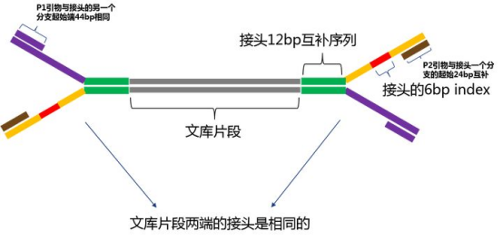

一般出现在3'端，在上面第1题中已经说到，最终的测序结果应该Index+fragment+adapter2或者Index+部分fragment，也就是说测序的方向是从5'到3'，adapter只可能出现在3'端。
## 代码练习
### 去除 data 中 test.fq 中，末尾碱基是 adaptor 序列（CAACTGGTTCCATG）的 reads
```python
import re
import os

file1 = "data/test.fq"
file2 = "data/test.refq"
key = "CAACTGGTTCCATG$"
out = list(["", "", "", ""])

if os.path.exists(file2):
    os.remove(file2)

with open(file1) as p, open(file2, mode="a") as p2:
    while 1:
        for v in range(4):
            d = p.readline()
            out[v] = d
        if d == "":
            break
        if re.search(key, out[1]):
            continue
        p2.writelines(out)
```
## 第6题 读懂FastQC报告 Part I (per base sequence quality)
在实际操作和处理过程中，我们拿到的Illumina测序数据应该是.fastq.gz格式，其中gz表示的是使用gzip
进行压缩，fastq表示使用fastq格式进行存储。获得数据的第一步，通常就是使用FastQC软件进行质
控。FastQC会对每一个输入的fastq.gz文件生成1个html网页和一个zip的压缩包，压缩包里是网页中包
含的图片信息，只需要看网页里面整理好的内容就好。

学会看懂 FastQC 的结果是认识测序数据的第一步，一般情况下 FastQC 的结果中比较核心的是下面框
出来的几个图。

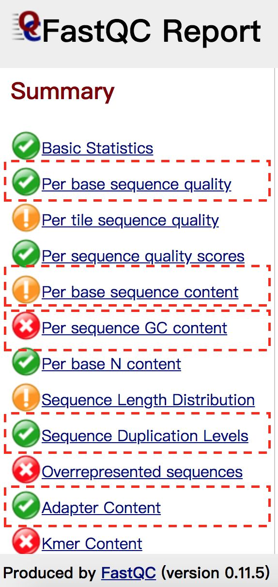

我们先来认识第一张图，Per base sequence quality （序列各位置碱基质量值分布图）

图1
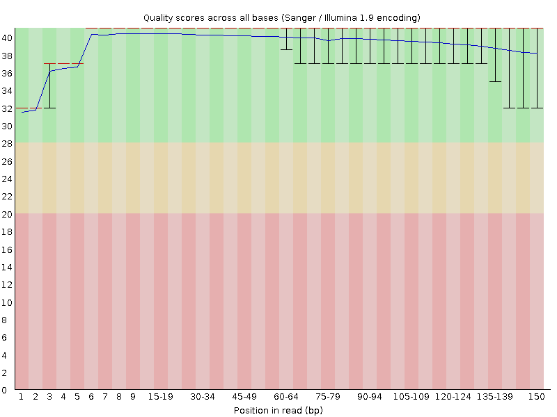

图2
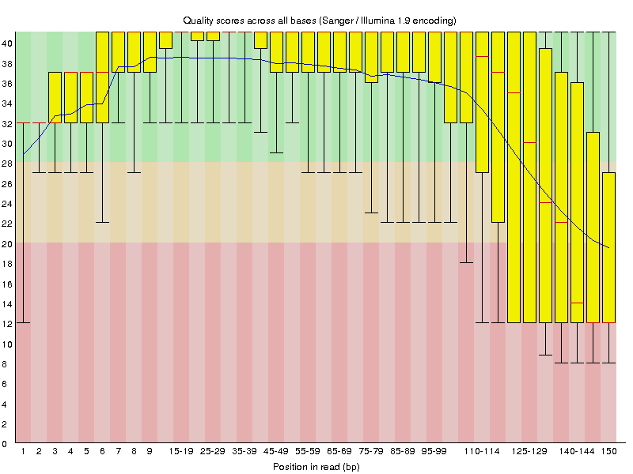

## 问答题：
### 6.1 图中的横坐标表示什么意思？
横轴：测序序列的1-251个碱基；
### 6.2 图中的纵坐标表示什么意思？
纵轴：质量得分，score = -10 * log10（error），例如错误率error为1%，那么算出的score就是20
### 6.3 图中的蓝色线是什么意思？
蓝色的线将各个碱基的质量平均值连接起来
### 6.4 图中的box 下面的bar ， 上面的bar，箱体的下沿，箱体的上沿，箱体内部的红色横线分别代表什么意思？
箱线图boxplot：对每一个碱基的质量的统计。箱子上面的须（up bar）为90%分位数，下面的须（down bar）为10%分位数，箱子中的红线为中位数即50%分位数，箱子顶（upside）为75%分位数，箱子低（downside）为25%分位数。这个boxplot的意义：一是看数据是否具有对称性；二是看数据分布差异，这里主要利用了第二点。bar的跨度越大，说明数据越不稳定。
### 6.5 图1与图2最主要的区别在哪里？结合之前的问题，为什么会出现这种情况？
    FastQC 结果解读 ： https://zhuanlan.zhihu.com/p/20731723
    FastQC 真实结果示例见 data 下的 test.R1_fastqc.html，test.R2_fastqc.html
主要区别在于图1测序数据很稳定，score得分基本都在Q30以上，而图2数据不稳定，第1和110-150bp的数据均达不到Q20标准，需舍去。
## 代码练习
### 统计 data 中 test.fq 的各位置的平均碱基质量和碱基质量值中位数，结果以表格形式提供。 
#### 结果展示示例如下： 
    pos mean median
    1 20.1 21 
    2 20.5 23 
    ......
```python
import numpy as np

file1 = "data/test.fq"
file2 = "data/test.total"
a = np.empty((0, 150))
n = 0
with open(file1) as p:
    while 1:
        d = p.readline()
        if d == "":
            break
        n += 1
        if n % 4 == 0:
            tmp = np.frombuffer(str(d[0:-1]).encode("utf-8"), dtype=np.uint8)
            a = np.row_stack((a, tmp))
a2 = a.mean(0)
i = a.shape[0] // 2
a.sort(0)
with open(file2, mode="w") as p2:
    p2.write("pos\tmean\tmedian\n")
    for v in range(150):
        p2.write(str(v + 1) + "\t" + str(a2[v]) + "\t" + str(a[i, v])+"\n")
```
## 第7题 读懂FastQC报告 Part II (per base sequence content)
继续认识 Fastqc 其他几张重要的图， Per base sequence content（序列各位置碱基占比分布图）。

图1
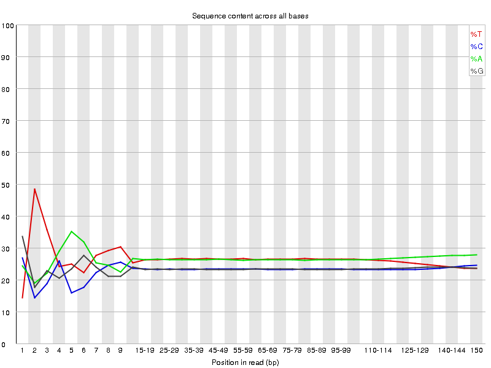

图2
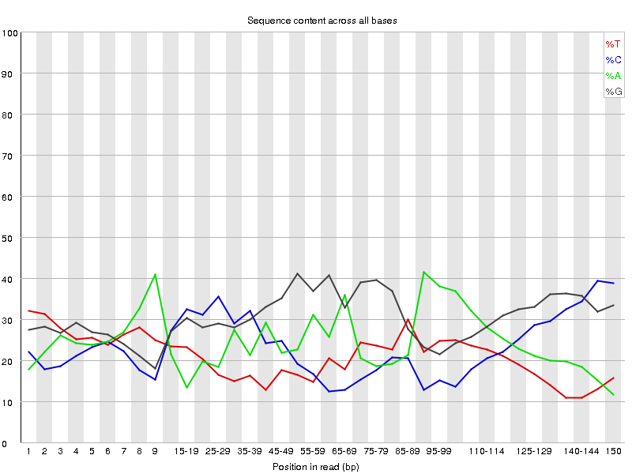
## 问答题：
### 7.1 图1与图2中横坐标是什么意思？纵坐标是什么意思？
横轴：各碱基位置；纵轴：碱基百分比

四条线四种颜色代表四种碱基在每个位置的平均含量（一个位置会测很多reads，然后求一个平均）
### 7.2 图1是1个正常的DNA 全基因组测序结果，为什么前面的几bp线是波动的？后面的线是平衡的？
一般来讲，A=T， C=G， 但是刚开始测序仪不稳定可能出现波动，这是正常的。一般不是波动特别大的，像这里cut掉前10bp就够了。另外如果A、T 或 C、G间出现偏差，只要在1%以内都是可以接受的
### 7.3 图2是1个特殊RNA建库的测序结果，4条线出现波动更可能是什么原因造成的？
是个单链RNA
### 7.4 在图1中你能不能看出一个恒定的量？（提示，同一物种间相同，不同物种间一般不同）如果能看出来，这个量是什么？数值大约是多少？
AT和CG含量

AT约为27%，CG约为23%
## 代码练习
### 统计 data 中 test.fq 的各位置的A,T,C,G,N碱基的比例（百分比），结果以表格形式提供。
### 结果展示示例如下：
    pos A T C G N 
    1 23 24 27 26 0 
    2 20.5 21 29 29 0.5 
    ......
```python
import numpy as np
import pandas as pd

file1 = "data/test.fq"
file2 = "data/test.count"
a = np.empty((0, 150))
n = 0
with open(file1) as p:
    while 1:
        d = p.readline()
        if d == "":
            break
        n += 1
        if n % 4 == 2:
            tmp = np.frombuffer(str(d[0:-1]).encode("utf-8"), dtype='S1')
            a = np.row_stack((a, tmp))

b = pd.DataFrame(a)
c = pd.DataFrame()
for v in range(150):
    tmp = b[v].value_counts()
    c = c.append(tmp)
o = c.div(c.sum(axis=1), axis=0) * 100
o.to_csv(file2, sep="\t", index_label="pos")
```
## 第8题 读懂FastQC报告 Part III (sequence GC and length distribution)
继续看图，Per sequence GC content 和 Sequence Length Distribution

图1
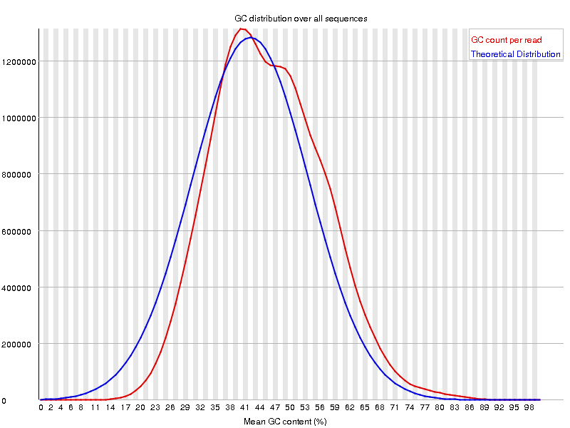

图2
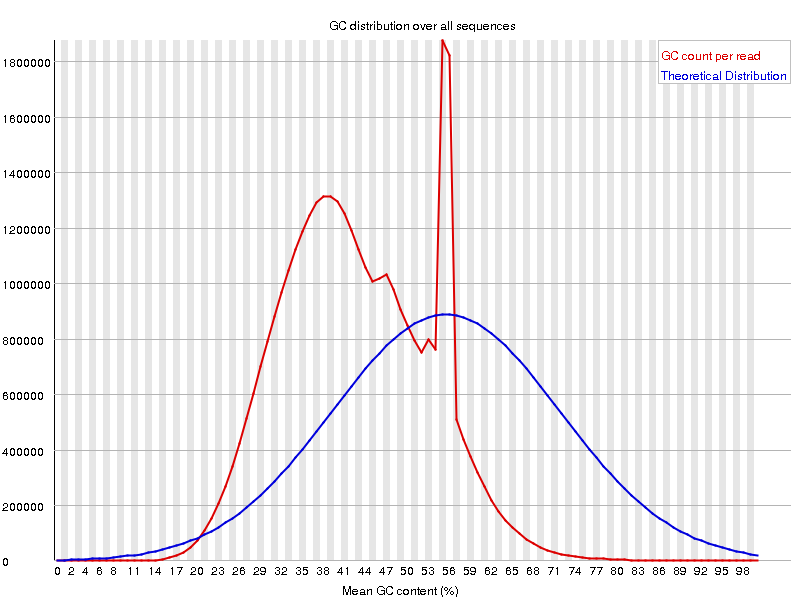

图3
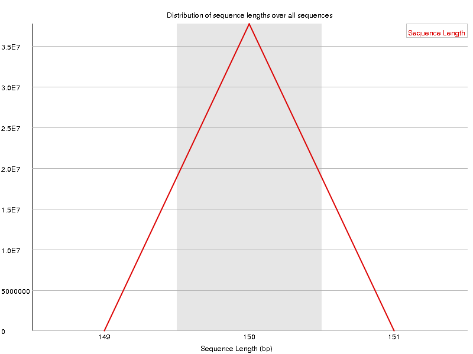

## 问答题：
### 8.1 图1 与 图2 中的横坐标是什么意思？ 纵坐标是什么意思？
横轴为平均GC含量； 纵轴为每个GC含量对应的序列数量

蓝线为系统计算得到的理论分布；红线为测量值，二者越接近越好
### 8.2 图1 与图2 有哪些显著的不同？造成这些不同的原因有可能是什么？遇到这个问题，我们通常应该做些什么？
图1理论值和测量值相近，和图2理论值和测量值偏差较大。

这里不相符可能有两个原因：

1、前面提到了，GC可以作为物种特异性根据，这里出现了其他的峰有可能混入了其他物种的DNA；

2、目前二代测序基本都会有序列偏向性(所说的 bias)，也就是某些特定区域会被反复测序，以至于高于正常水平，变相说明测序过程不够随机。这种现象会对以后的变异检测以及CNV分析造成影响

可以把和我们使用物种GC-content有差异的reads拿出来做blast，来确认是否为某些杂菌

### 8.3 图3 的横坐标是什么意思？纵坐标是什么意思？
图3为序列长度统计，横坐标为序列长度，纵坐标为此长度序列的数量。

理想情况下，测得的序列长度应该是相等的。实际上总有些偏差
### 8.4 图3 是刚下机的 fastq 数据进行FastQC 结果图，有什么特点？为什么会出现这样的结果？如果对刚下机的fastq数据进行cutadapter，图3 还会是这样的结果吗？为什么？
这里显示大部分都落在150bp这个测序长度上，有少量为149或151bp，但这不影响；如果偏差很大就不可信了。

简单来说是，下机的时候都是150bp，因为有的序列后来切掉了adapter，所以后来经过cut adapter以后，长短不齐，但也只是少数；

测序仪成功下机的数据都是整齐的一定长度的序列，比如最常用的illumina X Ten 是双端150bp；

测序过程当中产生的不足150bp的序列在下机时已经被过滤掉了；

如果进行cut adapter，序列的长度将不一致，因为reads中包含信息的insert的长度并不完全一致，150bp的测序长度是否已经包含了adapter的序列是未知的，因此cut adapter之后的reads长度不同

（这里应该说的是3’ adapter）

## 代码练习
# 统计 data 中 test.fa 的文件，统计每条序列的 GC 含量，以及总的 GC 含量。

# 结果展示示例如下： 
    chr GC% 
    1 33.2 
    2 45.1 
    ...... 
    total 27.2
```python
import numpy as np
import pandas as pd

file1 = "data/test.fq"
file2 = "data/test.cg"
a = np.empty((0, 150))
n = 0
with open(file1) as p:
    while 1:
        d = p.readline()
        if d == "":
            break
        n += 1
        if n % 4 == 2:
            tmp = np.frombuffer(str(d[0:-1]).encode("utf-8"), dtype='S1')
            a = np.row_stack((a, tmp))

b = pd.DataFrame(a)
c = pd.DataFrame()
for v in range(150):
    tmp = b[v].value_counts()
    c = c.append(tmp)
o = c[[b'C', b'G']].sum(axis=1) / c.sum(axis=1) * 100
total = c[[b'C', b'G']].sum(axis=1).sum() / c.sum(axis=1).sum() * 100
o.index = o.index + 1
o.name = 'GC%'
o.to_csv(file2, sep="\t", index_label="pos")
with open(file2, mode="a") as p2:
    p2.write("total\t"+str(total))
```

## 第9题 读懂 FastQC 报告 Part IV (duplicate)
duplicate 的产生主要是因为Illumina建库的过程中，一般会需要使用PCR来帮助扩增插入序列的浓度。
在扩增的过程中，如果PCR扩增轮数过大，就会出现duplicate的问题，即产生一模一样的若干条序列。
FastQC中“Sequence Duplication Levels”图是用来刻画duplicate情况的。

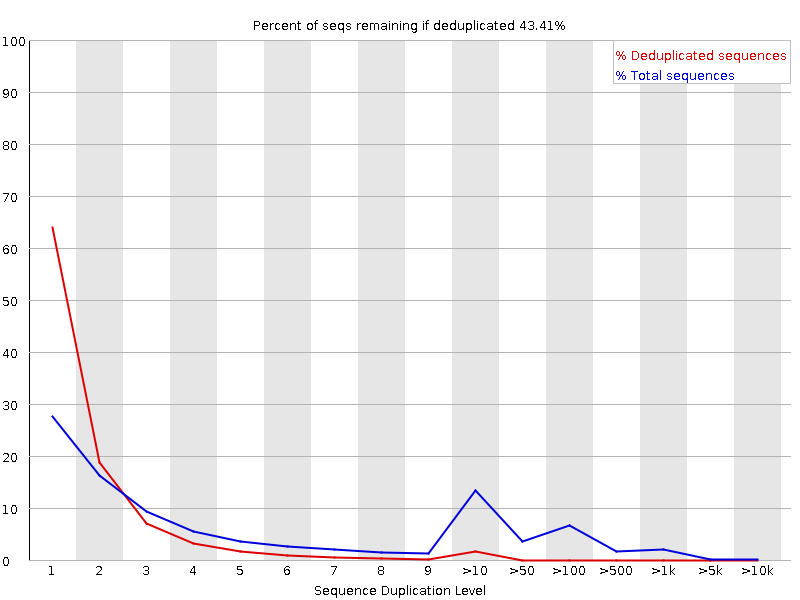

## 问答题：
### 9.1 图中的横坐标是什么意思，纵坐标是什么意思？
横坐标代表序列重复水平，纵坐标代表重复水平序列占所有序列的百分比。
### 9.2 图中的红线和蓝线分别代表什么意思？
红线：代表去duplicate之后序列理论重复性分布（服从possion distribution或者binomial distribution）的情况；

蓝线：代表全部的序列重复性分布情况。
### 9.3 图1中的duplicate是全部序列的duplicate的情况吗？还是随机筛选了一部分？为什么要这样做？
是选择的每一个文件里面前100, 000条序列作为样本进行的计算，因为样本本身很大，前100, 000已经能够代表样本的重复性。
### 9.4 如果让你写程序，判断1个fastq文件中duplicate的比例，你的大概思路是什么？
思路1：
```python
# Python风格的伪代码
# 第1步，对序列进行排序
sort the FASTQ file by the sequence, and names as sorted_file;
# 第2步，对排序的序列统计是否为duplicate
total_num = 1
duplication_num = 0
reads_1 = sorted_file.readline()
for reads_2 in sorted_file:
    if reads_1 == reads_2
        duplication_num += 1
    else:
        reads_1 = reads_2
    total_num += 1
print(total_num)
print(duplication_num)
```
思路2
利用pandas包的drop_duplicates()去重功能，再计算去重前后比值。
## 代码练习
### # 去除 data 中 test.fq 的文件中重复的序列
```python
import pandas as pd

file1 = "data/test.fq"
file2 = "data/test.dup"
li = list()
n = 0
with open(file1) as p:
    while 1:
        d = p.readline()
        if d == "":
            break
        n += 1
        if n % 4 == 2:
            li.append(d)
b = pd.DataFrame(li)
c = b.drop_duplicates().index
n = 0
m = 0
d = list(["", "", "", ""])
with open(file1) as p, open(file2, mode="w") as p2:
    while 1:
        for v in range(4):
            d[v] = p.readline()
        if d[0] == "":
            break
        if n < len(c):
            if c[n] == m:
                p2.writelines(d)
                n += 1
        m += 1
```
## 第10题 读懂 FastQC 报告 Part V (adapter)
adapter的最主要的作用是为了能够与flowcell连接，方便进行桥式PCR。那么我们的fastq文件中到底含
不含adapter呢？FastQC报告就能告诉我们。

图1
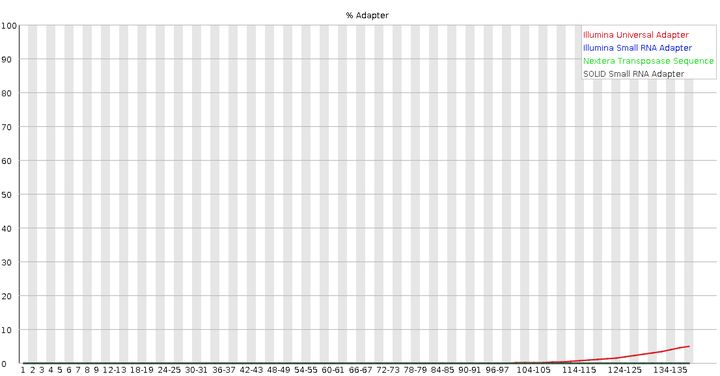

图2
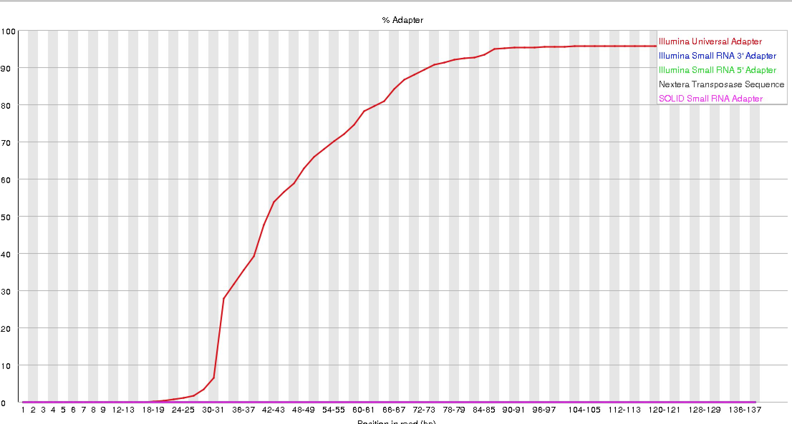

## 问答题：
### 10.1 Illumina的通用adapter序列是什么？图 1与图 2中的各种不同颜色的图例是什么意思？
Illumina的通用adapter序列：

    Top adapter
    5' ACACTCTTTCCCTACACGACGCTCTTCCGATC*T 3'
    Bottom adapter
    5' P-GATCGGAAGAGCGGTTCAGCAGGAATGCCGAG 3'
不同颜色的图例代表不同的测序通用的adapter；

如果在当时fastqc分析的时候-a选项没有内容，则默认使用图例中的通用adapter序列进行统计。
### 10.2 图 1与图 2中的横坐标与纵坐标分别是什么意思？
横坐标代表reads中的位置，纵坐标代表adapter序列含量的百分比。
### 10.3 图 1与图 2中最显著的差异是什么？如果两者都是RNA-Seq的数据，哪个可以继续下游分析，哪个不能够进行下游分析？为什么？
    FastQC 文档 Adapter Content ： https://www.bioinformatics.babraham.ac.uk/projects/fastqc/Help/3%20Analysis%20Modules/11%20Kmer%20Content.html
图1可以继续下游分析～

图1，结果表明少量的序列3’ 端检测到了少部分的adapter序列，且测序时使用的是红色图例所代表的的adapter；

图2，结果表明测序时使用的是红色图例代表的adapter；除了前20bp，reads后半段序列有很高的比例都是adapter，建库可能存在问题。
## 代码练习
###  利用 data 中 test.fq 的文件，找到含有 adapter 序列 CCTGTAATCCCA 的 reads 的 id 
### 结果示例 ： 
    @SRR11718844.104 
    @SRR11718844.114 
    ...
```python
import re
import os

file1 = "data/test.fq"
file2 = "data/test.10id"
key = "CCTGTAATCCCA"
out = list(["", "", "", ""])

if os.path.exists(file2):
    os.remove(file2)

with open(file1) as p, open(file2, mode="a") as p2:
    while 1:
        for v in range(4):
            d = p.readline()
            out[v] = d
        if d == "":
            break
        if re.search(key, out[1]):
            p2.writelines(out[0][:17]+"\n")
```